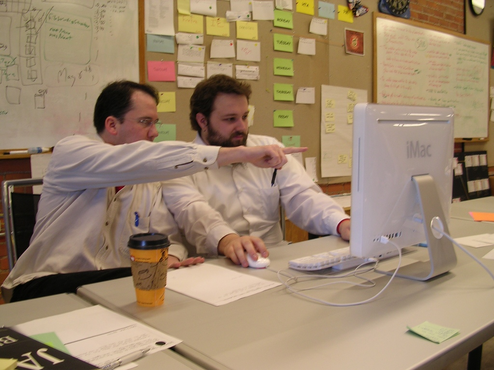
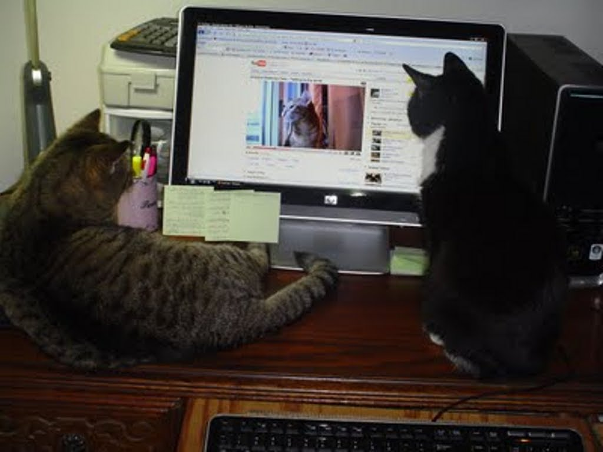

!SLIDE
# Working setups #

!SLIDE bullets incremental
# 2 on 1 #
## The usual ##

* One monitor
* One mouse
* One keyboard

!SLIDE center

!SLIDE center

!SLIDE bullets incremental
# 2 on 1.5 #
## The hashrocket way ##

* One monitor
* Two mice
* Two keyboards

!SLIDE center

!SLIDE bullets incremental
# 2 on 2 #
## Together yes but not coupled ##

* Two computers
* The main computer
* The auxiliary computer

!SLIDE

!SLIDE bullets incremental
# Remote pairing #

* Two computers
* Shared screen technologies (Tmux/Screen, YuuGuu)
* Audio communication (Skype)
* Chat